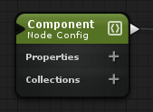
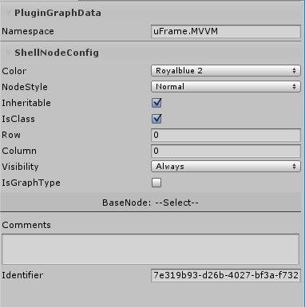
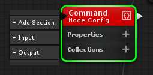
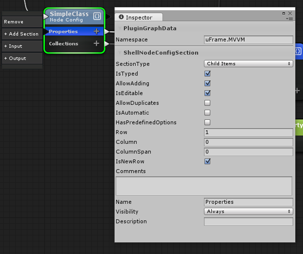

# uFrame Architect Framework

### What is uFrame Architect Framework ?
----------
uFrame Architect Framework is an internal project that let's you generate Models, ViewModels and Drawers based on diagram data.
It allows you to prototype your own node-based framework, such as uFrame ECS, uFrame MVVM and basically build with uFrame Architect Framework.

### Quick Start of uFrame Architect Framework 
----------
1. Clone the essential parts in to local folder Asset/Plugins/:
	[ uFrame/Core ](https://github.com/uFrame/Core) | [ uFrame/Architect ](https://github.com/uFrame/Architect) | [UniRx](https://github.com/neuecc/UniRx/releases) 
	
2. Open Window -> uFrame -> Graph Window

3. Focus on the bottom left, Click "Database" Tab

4. Click "Manage" (Make sure there is no workspace popup at the moment)

5. Select "New Empty Database", Edit "Name", "Namespace", "CodePath" for your project, and click "Create"

6. Select "Create Architect Workspace" and rename "Name", click "Create"

7. Select "Plugin", rename "Name", Click "Create"

8. Enjoy your uFrame Architect tour !!

### uFrame Architect Framework Overview
----------
Before diving into uFrame Architect Framework, we need to have a overview of the framework

#### Plugin Designer

Plugin Designer is the start point of uFrame Architect Framework ( You can also find similar things in other frameworks ).
In Plugin Designer, we define our framework as below

1. Registe Child GraphItem
2. Registe Graph
3. Registe Filter Node into graph ( What kind of nodes do we have in a graph)
4. Registe Code Generate Template with specfic node
5. Registe Connetable source and target ( Make two nodes or items can be connected with line )

#### Nodes and Node Item

##### ShellPluginNode
The root node of your framework

For example 

 

##### ShellNodeConfig
The most use node, to define your nodes of your framework

For example 

 

Usually you use this kind of node to define the node which will appear in your framework's graph as below

A ShellNodeConfig can have multiple sections, inputs and outputs, which can be added as below

##### ShellNodeSectionsSlot, ShellNodeInputsSlot, ShellNodeOutputsSlot
All of these three slots can be use to define the child items of your node, you can edit the slots properties as below
(Open Inspector Window when the slot item is selected)

#### Generators
After hitting Build/Build All button, uFrame will help you to generate your node into code, the key is setting up your template class and register them with specific node. All template class should be inherited of IClassTemplate.
( more detail coming soon )
